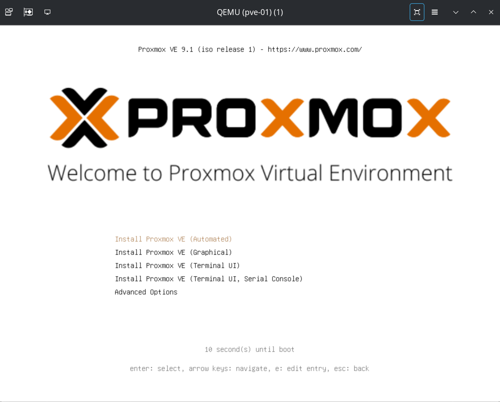
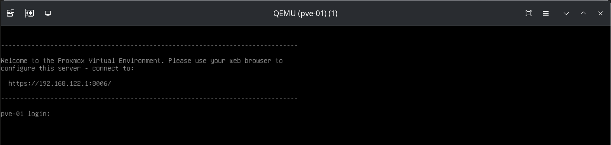

+++
title = "Virtual Proxmox Lab (Part 2) - Auto-Install Proxmox"
date = '2026-01-25T19:10:00Z'
draft = false
tags = ["proxmox","homelab","virsh"]
series = ["virtualization"]
categories = ["tutorials"]
+++

## 1. Introduction

Now, we will be deploying an enterprise-grade lab. Therefore we need to think about how we do things in production: we can't be clicking around and hoping for the best. This quickly compounds. We also need things to scale, to be idempotent (magic word for "always works the same") and self-healing. As I see this series going right now, we will be iterating the design of our lab a little bit as we go, since there is always room for improving and learning. That being said, I have done some changes to Part 1 to keep things consistent with this new post, add some stuff and fix minor errors. You should check it out.

### 1.1. Lab Design Progress

You will notice that I introduced a file server in the new networking diagram. That will be useful later for our Proxmox Backup Server configuration. I also introduced some other VMs we will be configuring in this lab later in this series:


### 1.2. IP and MAC Addresses

This is the full table of the MAC and IP addresses we are going to be using. Notice that the **vm** network will not be directly accessible by the PVE cluster. Also notice that we are using `02:00:00` MAC addresses, which indicate a "local administered address" (LAA). That means we are specifying them as not a manufacturer-assigned address. Take a long look at the MAC addresses and the IP addresses to see that we are going with something that makes sense:

| **Node** | **Network** | **IP Address** | **MAC Address** | **Alias** |
| --- | --- | --- | --- | --- |
| **pve-01** | WAN | `192.168.122.1` | `02:00:00:00:01:01` | `wan` |
|     | vm  |     | `02:00:00:01:01:01` | `vm` |
|     | HA/Corosync | `10.0.253.1` | `02:00:00:FD:01:01` | `ha` |
|     | Ceph | `10.0.254.1` | `02:00:00:FE:01:01` | `ceph` |
|     | Storage | `10.0.255.1` | `02:00:00:FF:01:01` | `store` |
| **pve-02** | WAN | `192.168.122.2` | `02:00:00:00:02:02` | `wan` |
|     | vm  |     | `02:00:00:01:02:02` | `vm` |
|     | HA/Corosync | `10.0.253.2` | `02:00:00:FD:02:02` | `ha` |
|     | Ceph | `10.0.254.2` | `02:00:00:FE:02:02` | `ceph` |
|     | Storage | `10.0.255.2` | `02:00:00:FF:02:02` | `store` |
| **pve-03** | WAN | `192.168.122.3` | `02:00:00:00:03:03` | `wan` |
|     | vm  |     | `02:00:00:01:03:03` | `vm` |
|     | HA/Corosync | `10.0.253.3` | `02:00:00:FD:03:03` | `ha` |
|     | Ceph | `10.0.254.3` | `02:00:00:FE:03:03` | `ceph` |
|     | Storage | `10.0.255.3` | `02:00:00:FF:03:03` | `store` |
| **pbs** | vm  | `10.0.1.10` | `02:00:00:01:00:0A` | `vm` |
|     | Storage | `10.0.255.10` | `02:00:00:FF:00:0A` | `store` |

### 1.3. Storage Design and Allocation

Rather than leaving everything to chance, let's do it very tight and predictable, as you would like in a production environment. These are the specs for each of the VMs which are "virtual hosts" (the Proxmox nodes and the future storage server):

| **VM Name** | **Role** | **vCPU** | **RAM** | **Boot Disk** | **Storage Disks** | **Purpose** |
| --- | --- | --- | --- | --- | --- | --- |
| **vm-pve-01** | PVE Node 1 | 4   | 20GB | 32GB (sda) | 2x 150GB (sdb, sdc) | Proxmox + Ceph OSDs |
| **vm-pve-02** | PVE Node 2 | 4   | 20GB | 32GB (sda) | 2x 150GB (sdb, sdc) | Proxmox + Ceph OSDs |
| **vm-pve-03** | PVE Node 3 | 4   | 20GB | 32GB (sda) | 2x 150GB (sdb, sdc) | Proxmox + Ceph OSDs |
| **pbs** | Storage | 2   | 4GB | 20GB | 1x 500GB | NFS/Shared Storage |

You could probably get away with 16GB RAM for the PVE nodes, however that will require some aggressive tuning of Ceph. Don't expect to be able to test fail over if you go that route. I think that it will also work if the host system has 64GB RAM if you're not going crazy with browsers and apps. Memory prices are a problem these days, but if you have 96GB RAM you're in a better spot. You could still leverage a bunch of physical hardware, but you need a managed switch to have the network right, so there's always a trade-off. This is how our finished storage will look like:


## 2. Setting up the Auto-Installer

We need to install the `proxmox-auto-install-assistant` program. Proxmox maintains it for Debian, because that's the platform where Proxmox runs. Assuming that you are following along on Arch: we can easily fix this with Distrobox: run a lightweight Debian 13 container and manager it from there. You could get away with a regular docker container or a Debian 13 (or Proxmox) VM too. I'm covering the Arch Linux steps:

### 2.1. Arch: Setting up Distrobox and Debian 13

First install it with `pacman`:

```bash
sudo pacman -S distrobox
```

Next, create a Debian 13 (at this time) container:

```
distrobox create -i debian:latest -n pve-tools
```

We gave it the name `pve-tools`. Enter the container, it should take a couple of minutes the first time:

```
distrobox enter pve-tools
```

Once you're in, your prompt will probably look a bit different from when you were directly on Arch. Make sure that the packages are running on the latest version:

```bash
sudo apt update && sudo apt dist-upgrade -y
```

Next, make sure the `keyrings` directory exists:

```
sudo mkdir -p /etc/apt/keyrings
```

Then, add the Proxmox GPG key:

```bash
sudo wget https://enterprise.proxmox.com/debian/proxmox-release-bookworm.gpg -O /etc/apt/keyrings/proxmox-release-bookworm.gpg
```

Add the Proxmox `no-subscription` repository:

```bash
echo "deb [signed-by=/etc/apt/keyrings/proxmox-release-bookworm.gpg] http://download.proxmox.com/debian/pve bookworm pve-no-subscription" | sudo tee /etc/apt/sources.list.d/pve.list
```

Then, set the right permissions to the `keyring` directory, update again and install the `proxmox-auto-install-assistant`:

```bash
sudo chmod 644 /etc/apt/keyrings/proxmox-release-bookworm.gpg
sudo apt update && sudo apt install -y proxmox-auto-install-assistant
```

Check that it's installed:

```bash
proxmox-auto-install-assistant --version
```

For now, open another terminal (or terminal tab) or leave the Distrobox container by typing `exit`.

### 2.2. Setting up the Auto-Installer ISO

#### 2.2.1. Create New Files

We will be exercising how to do this with node `pve-01`, and then we will replicate the steps to the other nodes later. Inside our project's folder, we will be heading to the folder to deal with files related to the guest systems. From the project's folder, run:

```bash
touch guests/pve-01/{answer_pve-01.toml,firstboot_pve-01.sh}
```

Run `tree -L 2` from the project's folder and your folder should be looking something like this:

```bash
$ tree -L 2
.
├── diagrams
├── guests
│   ├── pbs
│   ├── pve-01
│   │   ├── answer_pve-01.toml
│   │   └── firstboot_pve-01.sh
│   ├── pve-02
│   └── pve-03
├── host
│   ├── configs
│   │   ├── ceph-br.xml
│   │   ├── default.xml
│   │   ├── ha-br.xml
│   │   ├── st-br.xml
│   │   └── vm-br.xml
│   └── scripts
```

The two new files we've created, and their function are as follows:

- `answer_pve-01.toml`: The program `proxmox-auto-install-assistant` will use this file to configure the auto-installation of the Proxmox node.
- `firstboot_pve-01.sh`: The program `proxmox-auto-install-assistant` will insert this script to be executed in the first boot after the installation. We will use it to set a few extra configurations.

#### 2.2.2. Working on the Answer File

We would like to be using an ssh key-pair to connect to the servers when they are configured. If you don't have one and don't know how to generate one:

```bash
ssh-keygen -t ed25519 -C "yourname@machine"
```

And then `cat .ssh/id-ed25519.pub`. That's your public key. You will copy it into the `answer` configuration file.

You will edit your file with `vim guests/pve-01/answer_pve-01.toml`. This is my file, adjust yours according to your location, keyboard type and timezone and making sure to copy the SSH key between the double quotes:

```toml
[global]
keyboard = "en-us"
country = "ie"
fqdn = "pve-01.lab.local"
mailto = "admin@lab.local"
timezone = "Europe/Dublin"
root-password = "Secret123!"
root-ssh-keys = [

"ssh-ed25519 AAAAC3..."

]

[network]
source = "from-answer"
cidr = "192.168.122.1/24"
gateway = "192.168.122.254"
dns = "1.1.1.1"

[network.filter]
ID_NET_NAME_MAC = "*020000000101"

[network.interface-name-pinning]
enabled = true

[network.interface-name-pinning.mapping]
"02:00:00:00:01:01" = "wan"
"02:00:00:01:01:01" = "nic_vm"
"02:00:00:fd:01:01" = "ha"
"02:00:00:fe:01:01" = "ceph"
"02:00:00:ff:01:01" = "store"

[disk-setup]
filesystem = "ext4"
disk-list = ["sda"]

[first-boot]
source = "from-iso"
ordering = "before-network"
```

The trailing space might be important if you have issues, be sure to copy it too.

#### 2.2.3. Working on the First Boot

You will now `vim guests/pve-01/firstboot_pve-01.sh` and copy the script bellow and save it. I will then explain some things:

```bash
#!/bin/bash

# 1. Disable enterprise repos, enable no-subscription
rm -f /etc/apt/sources.list.d/pve-enterprise.list
cat <<EOF > /etc/apt/sources.list.d/pve-no-subscription.sources
Types: deb
URIs: http://download.proxmox.com/debian/pve
Suites: trixie
Components: pve-no-subscription
Signed-By: /usr/share/keyrings/proxmox-archive-keyring.gpg
EOF

cat <<EOF > /etc/apt/sources.list.d/ceph.sources
Types: deb
URIs: http://download.proxmox.com/debian/ceph-squid
Suites: trixie
Components: no-subscription
Signed-By: /usr/share/keyrings/proxmox-archive-keyring.gpg
EOF

# 2. Hosts entries for cluster
cat <<EOF >> /etc/hosts
192.168.122.1 pve-01.lab.local pve-01
192.168.122.2 pve-02.lab.local pve-02
192.168.122.3 pve-03.lab.local pve-03
EOF


# 3. Network config
cat <<EON > /etc/network/interfaces
auto lo
iface lo inet loopback

auto wan
iface wan inet static
address 192.168.122.1/24
gateway 192.168.122.254

iface nic_vm inet manual

auto vm_br
iface vm_br inet manual
bridge-ports nic_vm
bridge-stp off
bridge-fd 0
bridge-vlan-aware yes
bridge-vids 10,20,30 # 10 = intranet, 20 = dmz, 30 = mgmt

auto ha
iface ha inet static
address 10.0.253.1/24

auto ceph
iface ceph inet static
address 10.0.254.1/24

auto store
iface store inet static
address 10.0.255.1/24
EON

reboot
```

What we are doing here is simple:

- Disabling the Proxmox `enterprise` repositories and utilizing the `no-subscription` repositories.
- Adding the future Proxmox nodes to the `/etc/hosts` file so that this node knows them by name.
- Doing the final round of configuring this node's network interfaces into their permanent configuration.

## 3. Auto-Installing Proxmox VE

### 3.1. Obtain the Proxmox VE 9.1 ISO

All that we did so far was in preparation for this moment: we will now create the ISO file for the auto-install. As a requirement, you must download the Proxmox VE 9.1 ISO from the Proxmox website. Let's use `wget`:

```bash
sudo pacman -S wget

wget --show-progress -O /var/lib/libvirt/images/proxmox-ve_9.1-1.iso https://enterprise.proxmox.com/iso/proxmox-ve_9.1-1.iso
```

This should work if you followed section **2.1** from Part 1 of this tutorial series. If not, you need to run `wget` as `sudo`, or add the following ACLs to the `/var/lib/libvirt` directory. This is preferable as it will facilitate other steps in the future:

```bash
# Apply rwx permissions for your user to all existing files/dirs recursively
sudo setfacl -R -m u:$(whoami):rwx,m::rwx /var/lib/libvirt/

# Set default ACL - new files/dirs created inside inherit these permission
sudo setfacl -R -d -m u:$(whoami):rwx,m::rwx /var/lib/libvirt/
```

Check that you have it:

```bash
$ ls -l /var/lib/libvirt/images/proxmox-ve_9.1-1.iso
# Expected output
-rw-r--r-- 1 tlutkus tlutkus 17497854 Jan 25 15:36 /var/lib/libvirt/images/proxmox-ve_9.1-1.iso
```

### 3.2. Create the Auto-Install ISO for `pve-01`

Head back into your Distrobox instance `distrobox enter pve-tools`. From our project's directory:

```bash
ISO_FILE="/var/lib/libvirt/images/proxmox-ve_9.1-1.iso"
ANSWER_FILE="guests/pve-01/answer_pve-01.toml"
FIRST_BOOT="guests/pve-01/firstboot_pve-01.sh"
OUTPUT="/var/lib/libvirt/images/pve-01_automated.iso"

proxmox-auto-install-assistant prepare-iso "${ISO_FILE}" \
--fetch-from iso \
--answer-file "${ANSWER_FILE}" \
--on-first-boot "${FIRST_BOOT}" \
--output "${OUTPUT}"
```

Check that this step ran successfully with `ls -l /var/lib/libvirt/images/pve-01_automated.iso`:

```bash
$ ls -l /var/lib/libvirt/images/pve-01_automated.iso
# Expected Output
-rw-r--r--+ 1 libvirt-qemu libvirt-qemu 1833369600 Jan 23 17:13 /var/lib/libvirt/images/pve-01_automated.iso
```

You could `exit` Distrobox now, or move to another terminal window/tab.

### 3.3. Auto-Install Proxmox on `pve-01`

This is it: we are going to deploy `pve-01` automatically. for this step, I think that you will want to see the fireworks. It's better if you have a couple of terminal windows/tabs available. From the first one do:

```bash
virt-viewer -r -w pve-01
```

A `virt-viewer` window will pop up. Move it to a side. Head into your second terminal window and type/paste the following command. Watch the Proxmox installation unfold on the `virt-viewer` window we just created. It will run all the way to the end and power off the VM:

```bash
# Engineered Specs
VM_NAME="pve-01"
VM_RAM=20480 # 20GiB - adjust to your case
VM_CPU=4
ISO_PATH="/var/lib/libvirt/images/pve-01_automated.iso"
IMG_DIR="/var/lib/libvirt/images"

# Deployment
virt-install \
--name "$VM_NAME" \
--ram "$VM_RAM" \
--vcpus "$VM_CPU" \
--cpu host-passthrough \
--os-variant debian13 \
--graphics vnc,listen=0.0.0.0 \
--noautoconsole \
--boot cdrom,hd \
--cdrom "$ISO_PATH" \
--controller type=scsi,model=virtio-scsi \
--disk path="$IMG_DIR/${VM_NAME}_root.qcow2",size=32,format=qcow2,bus=scsi,cache=none,io=native \
--disk path="$IMG_DIR/${VM_NAME}_osd1.qcow2",size=150,format=qcow2,bus=scsi,cache=none,io=native \
--disk path="$IMG_DIR/${VM_NAME}_osd2.qcow2",size=150,format=qcow2,bus=scsi,cache=none,io=native \
--network bridge=virbr0,model=virtio,mac=02:00:00:00:01:01 \
--network bridge=vm-br,model=virtio,mac=02:00:00:01:01:01 \
--network bridge=ha-br,model=virtio,mac=02:00:00:FD:01:01 \
--network bridge=ceph-br,model=virtio,mac=02:00:00:FE:01:01 \
--network bridge=st-br,model=virtio,mac=02:00:00:FF:01:01
```

Your `virt-viewer` screen should give you this, wait for it to run automatically:



Once Proxmox installed and powered off, we need to do the first boot, so that the `firstboot_pve-01.sh` script will run automatically. Run:

```bash
virsh start pve-01
```

It will cycle one or two times through the first boot. Wait for up to a minute (depending on your hardware specs) for it to give you a terminal:



At his point you know your `pve-01` node has deployed successfully. Let's make sure it's really configured as we need it to, make sure that the `firstboot_pve-01.sh` script ran properly:

```bash
ssh -i .ssh/id-ed25519 root@192.168.122.1
```

Be mindful to specify the correct ssh key for your case. Once you're in, run `ip a` and you should get a similar output:

```bash
root@pve-01:~$ ip a | grep -E '(wan|nic_vm|ha|ceph|store|vm_br)' --color=auto
2: wan: <BROADCAST,MULTICAST,UP,LOWER_UP> mtu 1500 qdisc fq_codel state UP group default qlen 1000
    inet 192.168.122.1/24 scope global wan
3: nic_vm: <BROADCAST,MULTICAST,UP,LOWER_UP> mtu 1500 qdisc fq_codel master vm_br state UP group default qlen 1000
4: ha: <BROADCAST,MULTICAST,UP,LOWER_UP> mtu 1500 qdisc fq_codel state UP group default qlen 1000
    inet 10.0.253.1/24 scope global ha
5: ceph: <BROADCAST,MULTICAST,UP,LOWER_UP> mtu 1500 qdisc fq_codel state UP group default qlen 1000
    inet 10.0.254.1/24 scope global ceph
6: store: <BROADCAST,MULTICAST,UP,LOWER_UP> mtu 1500 qdisc fq_codel state UP group default qlen 1000
    inet 10.0.255.1/24 scope global store
7: vm_br: <BROADCAST,MULTICAST,UP,LOWER_UP> mtu 1500 qdisc noqueue state UP group default qlen 1000
```

If you're looking at the same output: congratulations, you just finished your auto-install of `pve-01`. You can `exit` the `pve-01` shell. Additionally, `virsh destroy pve-01` to power it off and clean up after yourself.

## 4. Final Words for Part 2

We just did all the steps to get the first node `pve-01` deployed. As a homework, before you head into Part 3 next week, you go go about reproducing what we just did for `pve-01` for `pve-02` and `pve-03`, being mindful to replace all the names and addresses in the files and commands we used. This would be a good exercise. That's not what we are doing next week. Instead, we will be using shell scripts to automate everything we've done so far, and make it idempotent and repeatable. As it was with Part 1, I might work on improvements and make further changes to the diagram. Thank you for stick with me until the end. Stay tuned for more!

God bless you.