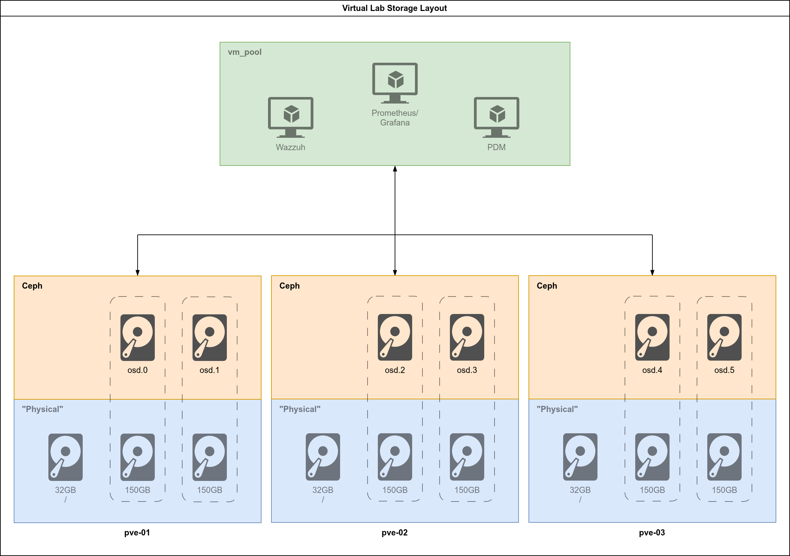

+++
title = "Virtual Proxmox Lab (Part 3) - Scripting the Lab Deployment"
date = '2026-02-01T17:20:00Z'
draft = false
tags = ["proxmox","homelab","virsh"]
series = ["virtualization"]
categories = ["tutorials"]
+++

+++
title = "Virtual Proxmox Lab (Part 3) - Scripting the Lab"
date = '2026-02-01T17:20:00Z'
draft = false
tags = ["proxmox","homelab","virsh"]
series = ["virtualization"]
categories = ["tutorials"]
+++

## 1. Introduction

### 1.1 Foreword

Over the last 2 weeks since I have started to write this series, I was asked a few times "what about" Ansible, Terraform and other automation tools. The easy answer is: they are besides the point of what I'm trying to achieve right now. When I learned to build a VMware cluster, I learned to build the virtualization platform first, and to understand the network topology and the whys. I think that good teaching builds toward something. This tutorial series is a lot about learning a builder's mindset and learning how to put some things together. It's not about a quick recipe for a ready-to-go thing. If I was aiming at just that, I could easily go to a "here's the GitHub repo, here are the requirements and some basic instructions and off you go". Or even "here's the repo, go to your chatbot and figure it out". Instead, I want the reader to see the struggles and feel the needs for certain tools. I'm also adding a lot of personal touch, like the way I'm doing the `~/libvirt` directory. I like the idea of taking the chance to teach a new trick or two, or go into territory that most DevOps Engineers or SREs don't go to. If you think about it, in this series I'm teaching how to build a virtualization cluster. I'm also excited to iterate on my network diagram designs, on the cluster design itself and for people to maybe see it and feel stoked to get into "learning the craft" through repetition and persistence.

### 1.2 What We Are Building

That all being said, today we will be doing a little bit of automation. I will be teaching you how to write a couple of shell scripts to just put together and dismantle the whole virtual lab very easily, because this is the playground where we will be doing other interesting stuff in the future. I hope that this is not going in the direction of feature creep: when we are done with this series (and it looks like it will be more than 5 parts by now) we will have, in addition to the 3 virtual Proxmox nodes:

- A PBS VM on the same layer as the 3 PVE nodes.
- A PDM VM nested under the 3 PVE nodes.
- A Prometheus/Grafana dashboard monitoring the cluster.
- A Wazzuh VM doing the SIEM.


All of these things, before they things which can be automated, are things which can be designed, installed, perfected. Personally, I don't learn really well if I'm just copying ready-to-go recipes. I learn well by following along thoughtfully. If you enjoy that too, then we will have fun together. If not, maybe you're looking at the wrong place, the internet is packed full of "ready-to-go" and AI can just as easily give you that.

### 1.3 Back to the PVE Node's Specs

In Part 2 I provided the following table about the specs for the PVE nodes:

| **VM Name**         | **Role**            | **vCPU**            | **RAM**             | **Boot Disk**       | **Storage Disks**   | **Purpose**         |
| ------------------- | ------------------- | ------------------- | ------------------- | ------------------- | ------------------- | ------------------- |
| **pve-01**          | PVE Node 1          | 4                   | 20GB                | 32GB (sda)          | 2x 150GB (sdb, sdc) | Proxmox + Ceph OSDs |
| **pve-02**          | PVE Node 2          | 4                   | 20GB                | 32GB (sda)          | 2x 150GB (sdb, sdc) | Proxmox + Ceph OSDs |
| **pve-03**          | PVE Node 3          | 4                   | 20GB                | 32GB (sda)          | 2x 150GB (sdb, sdc) | Proxmox + Ceph OSDs |

And we went ahead and deployed `pve-01` following these specifications. The vCPU should be of type *host-passthrough* and the disk controllers should be *SCSI (virtio)*, which is not the same as just virtio. There are enough disks to build a fully redundant Ceph pool, allowing us to have a full node failure or single disk failures, this is the kind of resilience which is reasonable for a cluster of this size.



At the end of this part you will have a couple of scripts which will have the whole playground set up from scratch, identical and repeatable:

- `create_iso.sh` with this we will simplify the ISO creation process.
- `deploy_lab.sh` with this we will deploy the entire lab with the networks and the 3 nodes fully installed and network-configured.
- `destroy_lab.sh` with this we will destroy the whole lab: the 3 nodes, their storage and the networks, so that your host machine is clean.

We will also write a handful of functions to facilitate the whole process. This will be the foundation for what comes next with building a cluster and adding PBS and PDM and will give us the chance to completely wreck things and retry them for as many times as we need.

## 2. Writing the `create_iso.sh` script

Back in Part 2 we already have the proto-script, which is our starting point:

```bash
ISO_FILE="/var/lib/libvirt/images/proxmox-ve_9.1-1.iso"
ANSWER_FILE="guests/pve-01/answer_pve-01.toml"
FIRST_BOOT="guests/pve-01/firstboot_pve-01.sh"
OUTPUT="/var/lib/libvirt/images/pve-01_automated.iso"

proxmox-auto-install-assistant prepare-iso "${ISO_FILE}" \
--fetch-from iso \
--answer-file "${ANSWER_FILE}" \
--on-first-boot "${FIRST_BOOT}" \
--output "${OUTPUT}"
```

You will be writing `guests/create_iso.sh`.

### 2.1 From Commands to Script

Those four lines that we ran work, but they are not robust. If you run them from the wrong directory, forget which node you're working with, or try to run them in a system where the `proxmox-auto-install-assistant` tool is not installed, it won't work and you'll be left guessing why. Besides that, it will require a bunch of copy and paste and editing the variables (or the command itself) every time you want to run it. We will be making this task easier and repeatable by adding:

1. A proper header with usage documentation.
2. Strict mode to catch errors early.
3. Input validation for the node argument.
4. Environment checks for OS and dependencies.
5. Clear error messages that tell you what went wrong and how to fix it.

### 2.2 The Header and Strict Mode

The proper shebang is `#!/usr/bin/env bash` which ensures that the script runs with bash regardless of where it's installed on the system.

The `set` line enables bash's strict mode:
- `-e` exits immediately if any command returns a non-zero status.
- `-u` treats unset variables as an error. If you typo a variable name, the script stops.
- `-o pipefail` makes sure that a pipeline `|` will return the exit status of the last command that failed, not just the final command.

### 2.3 Variables and Arguments

```bash
NODE="${1:-}"
ISO_FILE="/var/lib/libvirt/images/proxmox-ve_9.1-1.iso"
ANSWER_FILE="${NODE}/answer_${NODE}.toml"
FIRST_BOOT="${NODE}/firstboot_${NODE}.sh"
OUTPUT="/var/lib/libvirt/images/${NODE}_automated.iso"
```

We're pulling the node name from the first positional argument `${1}`. The `${1:-}` syntax provides an empty default if no argument is given, which prevents the `-u` flag from killing the script before we can show a helpful message.

We are writing the paths relative to `/var/lib/libvirt` as the default installation of *libvirt* stipulates. You could use here `${HOME}/libvirt` instead, if you're following along the bind mounts step laid out in Part 1. I'm assuming that you will run the script as root or have dealt with the directory permissions like I did.

Let's remember our directory structure from Part 1:

```bash
$ tree -L 2
.
├── diagrams
├── guests
│   ├── pbs
│   ├── pve-01
│   ├── pve-02
│   └── pve-03
├── host
│   ├── configs
│   │   ├── ceph-br.xml
│   │   ├── default.xml
│   │   ├── ha-br.xml
│   │   ├── st-br.xml
│   │   └── vm-br.xml
│   └── scripts
```

Now, if you remember part 2, we wrote file files `answer_pve-01.toml` and `firstboot_pve-01.sh` under `guests/pve-01`. We will have each virtual PVE node in their own folder and the script will look for those files according to the node's name using `${ANSWER_FILE}` and `${FIRST_BOOT}`.

### 2.4 Input Validation

```bash
if [[ -z "${NODE}" ]]
then
    echo "Usage: ${0} [pve-NN]" >&2
    echo "Missing a pve node as argument." >&2
    exit 1
fi
```

Before the script starts doing anything meaningful, we must check that the user actually provided a node name with the `-z` test verifying that the string is not empty.

Things to take note here:
- Redirect error messages to STDERR with `>&2` rather than STDOUT. It's helpful when someone is piping the outputs and don't want error messages and regular output mixed.
- Usage message showing how to invoke the script correctly is a stable best-practice.
- Exit with status 1 indicating failure, can be called with `${?}`.

### 2.5 Environment Checks

```bash
if ! grep -qi 'trixie' /etc/os-release
then
    echo "ERROR: Requires Debian 13 (Trixie)." >&2
    exit 1
fi

if ! dpkg-query -W proxmox-auto-install-assistant &>/dev/null
then
    echo "ERROR: Missing proxmox-auto-install-assistant package." >&2
    echo "Please refer to https://pve.proxmox.com/wiki/Automated_Installation for more information." >&2
    exit 1
fi
```

The `proxmox-auto-install-assistant` only exists in Promox's repos, which are only available on Debian (the base distro where Proxmox runs). For the version which we are working with right now, Debian 13 (Trixie) is required. If you're following along on Arch, we will manage this by running Debian 13 inside a Distrobox container. Alternatively, you could be doing this on a computer running Debian 13 or Proxmox. I suspect it's not far-fetched that it would also work on Ubuntu.

The first check grep `/etc/os-release` for "trixie" (case-insensitive). The second check with `dpkg-query` verifies that the required package is installed. We don't need to see the output, so we redirect both STOUT and STDERR to the black hole with `&>/dev/null`. We care only for the exit status. We are checking both cases with `!` meaning that this is a NOT conditional check.

### 2.6 The Main Event

```bash
proxmox-auto-install-assistant prepare-iso "${ISO_FILE}" \
   --fetch-from iso \
   --answer-file "${ANSWER_FILE}" \
   --on-first-boot "${FIRST_BOOT}" \
   --output "${OUTPUT}"
```

This is the same command that we ran in Part 2, just with the variables substituted. I broke it in different lines with `\` for readability.

### 2.7 Exit Status Handling

```bash
EXIT_STATUS="${?}"

if [[ "${EXIT_STATUS}" -ne 0 ]]
then
    echo "The script did not execute successfully!" >&2
    exit "${EXIT_STATUS}"
fi

exit 0
```

The special variable `${?}` holds the exit status of the last command. It's a good idea to capture that immediately to avoid the possibility that any other command executed successfully will overwrite it. We are intently announcing that the script did not run successfully if the main event did not complete. We then end the script with `exit 0` to make it clear that getting there is the definitive ending.

### 2.8 A Word on the License Header

You'll notice that I added a GPLv3 license block at the top. I'm releasing these scripts under the GPL, because I want you and anyone else to be able to use, modify and share them freely, with the condition that your derivative works remain open. Picking the right license matters, and in this day and age in which corporations will take and not really give back, it matters even more. I'm a firm believer in the GPLv3 and also everything the Free Software Foundation stands for, and I encourage you to inform yourself about it. I might write a post on this topic later.

This is the final result:

```bash
#!/usr/bin/env bash
#
# Script: create_iso.sh
# Purpose: Simple script to make the process of creating automated PVE installation ISO portable
# 
# Copyright (C) 2026 Thomas Lutkus
# This program is free software: you can redistribute it and/or modify
# it under the terms of the GNU General Public License as published by
# the Free Software Foundation, either version 3 of the License, or
# (at your option) any later version.
#
# Compatibility: Debian 13 (must run inside Distrobox on Arch Linux)
# Dependencies: proxmox-auto-install-assistant
# https://pve.proxmox.com/wiki/Automated_Installation#Assistant_Tool
# Requires: root or full access to the libvirt directory
#
# Usage: ./create_iso.sh [PVE_NODE]
#
# Author: Thomas Lutkus
# Date: 2026-01-22
# Version: 1.2

set -euo pipefail

# Script constants and variables go here
NODE="${1:-}"
ISO_FILE="/var/lib/libvirt/images/proxmox-ve_9.1-1.iso"
ANSWER_FILE="${NODE}/answer_${NODE}.toml"
FIRST_BOOT="${NODE}/firstboot_${NODE}.sh"
OUTPUT="/var/lib/libvirt/images/${NODE}_automated.iso"


# Verifications to run the script
# Check usage
if [[ -z "${NODE}" ]]
then
    echo "Usage: ${0} [pve-NN]" >&2
    echo "Missing a pve node as argument." >&2
    exit 1
fi

# Check for super user privileges
# if [[ "${UID}" -ne 0 ]]
# then
#     echo "ERROR: Must run as root." >&2
#     exit 1
# fi

# Check for Debian 13
if ! grep -qi 'trixie' /etc/os-release
then
    echo "ERROR: Requires Debian 13 (Trixie)." >&2
    exit 1
fi

# Check for the assistant tool
if ! dpkg-query -W proxmox-auto-install-assistant &>/dev/null
then
    echo "ERROR: Missing proxmox-auto-install-assistant package." >&2
    echo "Please refer to https://pve.proxmox.com/wiki/Automated_Installation for more information." >&2
    exit 1
fi

proxmox-auto-install-assistant prepare-iso "${ISO_FILE}" \
   --fetch-from iso \
   --answer-file "${ANSWER_FILE}" \
   --on-first-boot "${FIRST_BOOT}" \
   --output "${OUTPUT}"

EXIT_STATUS="${?}"

if [[ "${EXIT_STATUS}" -ne 0 ]]
then
    echo "The script did not execute successfully!" >&2
    exit "${EXIT_STATUS}"
fi

exit 0
```

## 3. Writing the `deploy_lab.sh` Script

### 3.1 What it Does

We already went through some concepts I adhere to when shell scripting when writing `create_iso.sh`, so I will not repeat myself on those. Instead, I will present some new things in this script which I find useful.

The script will create all the networks, provision the VMs and boot them. It will do some basic checks for the requirements and existence of files, and will also use some cosmetics for the output, so that it looks very professional. I find it encouraging when the script turns out like this one did.

### 3.2 The Flow

Nothing like a flowchart to show how it works. Since I'm flexing my drawing muscles whenever I can, I thought this script was a nice opportunity to throw a flowchart into our project:


This is by no means a software development project, but I think that it's a nice visual reference for the code. I won't repeat myself on shell scripting concepts, but I will explain some of the interesting stuff that it does.

### 3.3 What's New Here

#### Status Functions and Cosmetics

Why bother? Well, when deploying a bunch of VMs and networks a wall of white output text with barely any formatting doesn't do wonders for identifying what is actually happening. Personally, I like neat, informative output. Color-coded output allows us to scan and identify problems instantly.

```bash
# Status Colors
RED='\033[0;31m'
GREEN='\033[0;32m'
YELLOW='\033[0;33m'
BLUE='\033[0;34m'
NC='\033[0m'  # No Color

# Status functions
ok()   { echo -e "${GREEN}[OK]${NC}    $1"; }
info() { echo -e "${BLUE}[INFO]${NC}  $1"; }
warn() { echo -e "${YELLOW}[WARN]${NC}  $1"; }
fail() { echo -e "${RED}[FAIL]${NC}  $1"; }
status() {
    local label="$1"      # First arg: what we're reporting on, e.g., "[VM] pve-01"
    local status="$2"     # Second arg: the status text, e.g., "OK" or "FAIL"
    local color="$3"      # Third arg: color variable, e.g., "${GREEN}"
    local width=50        # Fixed width for alignment
    local dots=$(( width - ${#label} ))  # Calculate padding: 50 minus label length
    printf "%s %s %b%s%b\n" "$label" "$(printf '.%.0s' $(seq 1 $dots))" "$color" "$status" "$NC"
}

header() {
    echo -e "${BLUE}"
    echo "═══════════════════════════════════════════════════════════"
    echo "  Virtual Proxmox Lab Deployment"
    echo "═══════════════════════════════════════════════════════════"
    echo -e "${NC}"
}

footer() {
    echo -e "${GREEN}"
    echo "═══════════════════════════════════════════════════════════"
    echo "  Deployment complete. VMs installing."
    echo "  Run: virsh start pve-{01,02,03} after install completes"
    echo "═══════════════════════════════════════════════════════════"
    echo -e "${NC}"
}
```

The `header()` and `footer()` functions are pretty self-evident. The other parts are as follows:

- **Status colors** are just assigning names to the color codes so that they are easier to call.

- **Status functions** are each for different purposes:

    - `info()` is before configuring each network.
    - `ok()` is when a network was defined/started successfully.
    - `warn()` is when a network already existed/running.
    - `fail()` is when there are missing config files (validation).
    - `status()` is for the steps in the VM provisioning loop.

When you look a the whole script and check it out with the help of flowchart it will be clearer how every piece comes together.

#### Parsing the VM Configuration File

First you will create the file `host/configs/vm.conf` and will add the following content into it:

```
pve-01,02:00:00:00:01:01,02:00:00:01:01:01,02:00:00:FD:01:01,02:00:00:FE:01:01,02:00:00:FF:01:01
pve-02,02:00:00:00:01:02,02:00:00:01:01:02,02:00:00:FD:01:02,02:00:00:FE:01:02,02:00:00:FF:01:02
pve-03,02:00:00:00:01:03,02:00:00:01:01:03,02:00:00:FD:01:03,02:00:00:FE:01:03,02:00:00:FF:01:03
```

The new line at the end might be necessary, though the script has corrective measure for it. The structure is that of a CSV file with the following variable mapping on the script:

| Variable                         | Field                            | Maps to                          | Purpose                          |
| -------------------------------- | -------------------------------- | -------------------------------- | -------------------------------- |
| `VM`                             | 1                                | `--name`                         | VM name (pve-01, pve-02, pve-03) |
| `MAC_WAN`                        | 2                                | `bridge=virbr0`                  | Management/WAN network           |
| `MAC_VM`                         | 3                                | `bridge=vm-br`                   | VM traffic network               |
| `MAC_HA`                         | 4                                | `bridge=ha-br`                   | High availability/Corosync       |
| `MAC_CEPH`                       | 5                                | `bridge=ceph-br`                 | Ceph cluster traffic             |
| `MAC_STORE`                      | 6                                | `bridge=st-br`                   | Storage network                  |

We made a conscious choice for explicit MACs to have predictable addressing. That makes it easy for the auto installation of Proxmox and the first-boot script to configure the networking properly. We want to achieve proper networking before we would configure anything else in the cluster, that's the desirable state when the installation is finished.

The core of the VM provisioning loop is right here:

```bash
while IFS=',' read -r VM MAC_WAN MAC_VM MAC_HA MAC_CEPH MAC_STORE || [[ -n "$VM" ]]; do
...
done < "${VM_FILE}
```

This is scanning the `vm.conf` file and getting each variable according to each line/node. The `|| [[ -n "$VM" ]]` ending catches (or is supposed to) by keeping looping while read succeeds, OR while VM is non-empty. Otherwise, the while loop will end on the last line, before it's processed.

#### The Complete `deploy_lab.sh` Script

```bash
#!/usr/bin/env bash
#
# Script: deploy_lab.sh
# Purpose: Script to deploy the entire Virtual Proxmox Lab
# 
# Copyright (C) 2026 Thomas Lutkus
# This program is free software: you can redistribute it and/or modify
# it under the terms of the GNU General Public License as published by
# the Free Software Foundation, either version 3 of the License, or
# (at your option) any later version.
#
# Compatibility: distro-agnostic
# Dependencies: libvirt, virt-install
# Requires: qemu:///system access (root or libvirt group)
#
# Usage: ./deploy_lab.sh [VM_FILE]
#
# Author: Thomas Lutkus
# Date: 2026-01-23
# Version: 1.0

set -euo pipefail

# Script constants and variables go here
# Status Colors
RED='\033[0;31m'
GREEN='\033[0;32m'
YELLOW='\033[0;33m'
BLUE='\033[0;34m'
NC='\033[0m'  # No Color

# Status functions
ok()   { echo -e "${GREEN}[OK]${NC}    $1"; }
info() { echo -e "${BLUE}[INFO]${NC}  $1"; }
warn() { echo -e "${YELLOW}[WARN]${NC}  $1"; }
fail() { echo -e "${RED}[FAIL]${NC}  $1"; }
status() {
    local label="$1"
    local status="$2"
    local color="$3"
    local width=50
    local dots=$(( width - ${#label} ))
    printf "%s %s %b%s%b\n" "$label" "$(printf '.%.0s' $(seq 1 $dots))" "$color" "$status" "$NC"
}

header() {
    echo -e "${BLUE}"
    echo "═══════════════════════════════════════════════════════════"
    echo "  Virtual Proxmox Lab Deployment"
    echo "═══════════════════════════════════════════════════════════"
    echo -e "${NC}"
}

footer() {
    echo -e "${GREEN}"
    echo "═══════════════════════════════════════════════════════════"
    echo "  Deployment complete. VMs installing."
    echo "  Run: virsh start pve-{01,02,03} after install completes"
    echo "═══════════════════════════════════════════════════════════"
    echo -e "${NC}"
}

# Functional variables
CONF_DIR="../configs"
VM_FILE="${1:-$CONF_DIR/vm.conf}"
declare -A NETWORKS
NETWORKS=(
    [default]="default.xml"
    [ceph-br]="ceph-br.xml"
    [ha-br]="ha-br.xml"
    [st-br]="st-br.xml"
    [vm-br]="vm-br.xml"
)

header

# Validation checks
# Check for the VM_FILE
[[ -f "${VM_FILE}" ]] || { fail "Missing VM file: ${VM_FILE}" >&2; exit 1; }

# Check for the network configuration XML files
for NET in "${!NETWORKS[@]}"; do
    FILE="${CONF_DIR}/${NETWORKS[$NET]}"
    [[ -f "${FILE}" ]] || { fail "Missing network file: ${FILE}" >&2; exit 1; }
done

# Define the networks 
for NET in "${!NETWORKS[@]}"; do
  
    info "Configuring: ${NET}"

    FILE="${CONF_DIR}/${NETWORKS[$NET]}"
  
    # Define the Network
    if virsh net-define "${FILE}" 2>/dev/null; then
        ok "Network ${NET} defined"
    else
        warn "Network ${NET} was already defined"
    fi

    # Start the network
    if virsh net-start "${NET}" 2>/dev/null; then
        ok "Network ${NET} started"
    else
        warn "Network ${NET} already running"
    fi

    # Autostart the network
    virsh net-autostart "${NET}" 2>/dev/null || true
done

# Set the VMs up with the attributes from the VM_FILE
while IFS=',' read -r VM MAC_WAN MAC_VM MAC_HA MAC_CEPH MAC_STORE || [[ -n "$VM" ]]; do    
  
    echo "Deploying: ${VM}"

    # VM Configuration Attributes
    VM_RAM=20480 # 20GiB
    VM_CPU=4
    ISO_PATH="/var/lib/libvirt/images/${VM}_automated.iso"
    IMG_DIR="/var/lib/libvirt/images"
  
    # Check for the ISO file
    [[ -f "${ISO_PATH}" ]] || { echo "Missing ISO: ${ISO_PATH}" >&2; exit 1; }

    # Deploy the VM
    status "[VM]    ${VM}" "DEPLOYING" "${YELLOW}"

    if virt-install \
      --name "${VM}" \
      --ram "${VM_RAM}" \
      --vcpus "${VM_CPU}" \
      --cpu host-passthrough \
      --os-variant debian13 \
      --graphics vnc,listen=0.0.0.0 \
      --noautoconsole \
      --boot cdrom,hd \
      --cdrom "${ISO_PATH}" \
      --controller type=scsi,model=virtio-scsi \
      --disk path="${IMG_DIR}/${VM}_root.qcow2",size=32,format=qcow2,bus=scsi,cache=none,io=native \
      --disk path="${IMG_DIR}/${VM}_osd1.qcow2",size=150,format=qcow2,bus=scsi,cache=none,io=native \
      --disk path="${IMG_DIR}/${VM}_osd2.qcow2",size=150,format=qcow2,bus=scsi,cache=none,io=native \
      --network bridge=virbr0,model=virtio,mac="${MAC_WAN}" \
      --network bridge=vm-br,model=virtio,mac="${MAC_VM}" \
      --network bridge=ha-br,model=virtio,mac="${MAC_HA}" \
      --network bridge=ceph-br,model=virtio,mac="${MAC_CEPH}" \
      --network bridge=st-br,model=virtio,mac="${MAC_STORE}" &>/dev/null; then
        status "[VM]    ${VM}" "OK" "${GREEN}"
    else
        status "[VM]    ${VM}" "FAIL" "${RED}"
    fi

done < "${VM_FILE}"

footer

exit 0
```

## **4. Writing the `destroy_lab.sh` Script**

### **4.1 What It Does**

This script reverses everything `deploy_lab.sh` created. VMs get shut down and undefined, their disks deleted, and the networks torn down. Run it when you want a clean slate to start over.

### **4.2 Teardown Order and Idempotency**

Order matters: VMs first, then networks. You can't undefine a network that still has VMs attached to it—libvirt will complain. This is the reverse of deployment, where we created networks before VMs.

Every destructive command has `|| true` appended. This makes the script idempotent: run it once, run it five times, you get the same result with no errors. VM already destroyed? Fine, move on. Network already undefined? No problem. This is defensive scripting—you don't want a teardown script to fail halfway because something was already partially cleaned up from a previous attempt.

The `--remove-all-storage` flag on `virsh undefine` deletes the qcow2 disk images along with the VM definition. No orphaned 150GB files cluttering your image directory.

### **4.3 The Optional -i Flag**

By default, the script leaves your custom ISOs intact. Regenerating them requires the Debian 13 Distrobox container and takes time. If you're iterating on the lab and just want to rebuild VMs, keeping the ISOs saves a step. Pass `-i` when you want a truly clean slate.

### **4.4 The Script**

```bash
#!/usr/bin/env bash
#
# Script: destroy_lab.sh
# Purpose: Script to tear down the whole Virtual Proxmox Lab easily.
# 
# Copyright (C) 2026 Thomas Lutkus
# This program is free software: you can redistribute it and/or modify
# it under the terms of the GNU General Public License as published by
# the Free Software Foundation, either version 3 of the License, or
# (at your option) any later version.
#
# Dependencies: libvirt
# Requires: qemu:///system access (root or libvirt group)
#
# Usage: ./destroy_lab.sh [-i] [CONFIG]
#
# Author: Thomas Lutkus
# Date: 2026-01-23
# Version: 1.0

set -euo pipefail

# Script constants and variables go here
CONF_DIR="../configs"
IMG_DIR="/var/lib/libvirt/images"
DEL_ISO="false"
NETWORKS=(ceph-br ha-br st-br vm-br)

# Functions
usage() {
    echo "Usage: ${0} [-i]" >&2
    echo "  -i  Also delete the custom ISO files" >&2
    exit 1
}

# Process script options
while getopts "i" OPTION
do
    case $OPTION in
    i) DEL_ISO="true" ;;
    *) usage ;;
    esac
done

# Shift the option away
shift $((OPTIND - 1))

# Assign a VM file file 
VM_FILE="${1:-$CONF_DIR/vm.conf}"

# Script execution
# Tear down VMs first (before networks)
while IFS=',' read -r VM _; do
  
    echo "Removing: ${VM}"

    # Shutdown and delete the VM and all files
    virsh destroy "${VM}" 2>/dev/null || true
    virsh undefine "${VM}" --remove-all-storage 2>/dev/null || true

    # Delete the ISO if the option was selected
    if [[ "${DEL_ISO}" == "true" ]]    
    then
        IMG_FILE="${IMG_DIR}/${VM}_automated.iso"
      
        echo "Deleting the ISO ${IMG_FILE}"
      
        rm -f "${IMG_FILE}"
    fi
done < "${VM_FILE}"

# Shutdown and delete the networks (after VMs are gone)
for NET in "${NETWORKS[@]}"; do
  
    echo "Removing network ${NET}"

    virsh net-destroy "${NET}" 2>/dev/null || true
    virsh net-undefine "${NET}" 2>/dev/null || true
done

exit 0
```

**Important:** I did not declare `default` in the `"${NETWORKS}"` list, because I still use it after I dismantle the lab. It's just like the `default` network which *libvirt* install originally. You could add that to the script if you like.

## 5. Deploying and Destroying the Virtual Lab

This is the simplest part. I will assume that you have a terminal capable of tabs or tiles, and that you have some understanding of the commands. At his point, you could clone my GitHub repository to make sure that you have the exact files, as you already understand what we built:

```bash
mkdir -p ~/Projects && git clone https://github.com/tomlutkus/virtual-proxmox-lab ~/Projects/virtual-proxmox-lab
```

### 5.1 Make the Files for the Other Nodes

Your directory structure should be something like this, if you haven't cloned my repository. This is also what's in there:

```bash
├── guests
│   ├── create_iso.sh
│   ├── pve-01
│   │   ├── answer_pve-01.toml
│   │   └── firstboot_pve-01.sh
│   ├── pve-02
│   │   ├── answer_pve-02.toml
│   │   └── firstboot_pve-02.sh
│   └── pve-03
│       ├── answer_pve-03.toml
│       └── firstboot_pve-03.sh
├── host
│   ├── configs
│   │   ├── ceph-br.xml
│   │   ├── default.xml
│   │   ├── ha-br.xml
│   │   ├── st-br.xml
│   │   ├── vm-br.xml
│   │   └── vm.conf
│   └── scripts
│       ├── deploy_lab.sh
│       ├── deploy_pve-01.sh
│       ├── deploy_pve-02.sh
│       ├── deploy_pve-03.sh
│       └── destroy_lab.sh
```

If you want to do things manually and you haven't done it yet on Part 2, you can copy the files `answer_pve-01.toml` and `firstboot_pve-01.sh` from `guests/pve-01` into `guests/pve-0{2..3}` and work the files to have the correct names and MAC addresses. You need to be very attentive. You could use my files from the repo instead.

### 5.2 Build the ISO files

**Pre-requisite:** Having the Proxmox VE 9.1 ISO you can download from the official website [here](https://www.proxmox.com/en/downloads/proxmox-virtual-environment/iso/proxmox-ve-9-1-iso-installer "here"). Move the ISO file: `mv ~/Downloads/proxmox-ve_9.1-1.iso /var/lib/libvirt/images/` (assuming you configured directory permissions, otherwise use `sudo`).

1. `distrobox enter pve-tools`
2. `cd ~/Projects/virtual-proxmox-lab/guests`
3. `chmod +x create_iso.sh`
4. `for N in pve-0{1..3}; do ./create_iso.sh "${N}"; done`
5. `ls /var/lib/libvirt/images/*automated.iso` → you should see the files `pve-01_automated.iso`, `pve-02_automated.iso` and `pve-03_automated.iso`.

### 5.3 Open a `virt-viewer` to Watch Lab Deploy

In another terminal run this to keep `virt-viewer` windows in parallel for each instance:

```bash
for N in pve-0{1..3}; do virt-viewer -w -r "${N}" & done
```

### 5.4 Run the `deploy_lab.sh` Script

From the same or another terminal run:

```bash
cd ~/Projects/virtual-proxmox-lab/host/scripts
chmod +x deploy_lab.sh
./deploy_lab.sh
```

You will see the installation unfold for all the 3 nodes. When they power down, start them again:

```bash
for N in pve-0{1..3}; do virsh start "${N}"; done
```

And wait for them to complete the boot processes while they run the first-boot script.

### 5.5 Test that it Works, Destroy, Repeat

If you followed the series faithfully until now, you should be able to:

```bash
ssh root@192.168.122.1
```

And log into the `pve-01` lab Proxmox VM successfully. You might need to specify your SSH key, or enter the password `Secret123!` depending on how your computer is configured. Once in the prompt, try:

```bash
ping -c 4 192.168.122.2
ping -c 4 192.168.122.3
```

If both were successful, your lab is fully configured and networked.

To destroy it, just run:

```bash
chmod +x destroy_lab.sh
./destroy_lab.sh
```

And watch as it's torn down and your workstation is completely clean of the VMs and networks.

## 6. Final Words on Part 3

This one was a lot of work to write. I did not want to turn it into a shell script course, but I wanted instead for you to get a feeling of the process of building the lab topology manually, seeing what works, and then automating the process. This is a fully functional staging environment to practice Proxmox and Ceph clustering, which will be topics for the the upcoming parts in the series.

My goal is **not** to help you get there as fast as possible. It is, instead, to hold your hands as you go through the mental processes yourself. Maybe you will have better ideas for some parts, or will have more knowledge about some things and that's great! I'd love to hear about that.

I'm still working on the concept for the next session, which is coming next week. We will progress with the clustering and towards having a fully functional Proxmox infrastructure. Stay tuned!

God bless you!